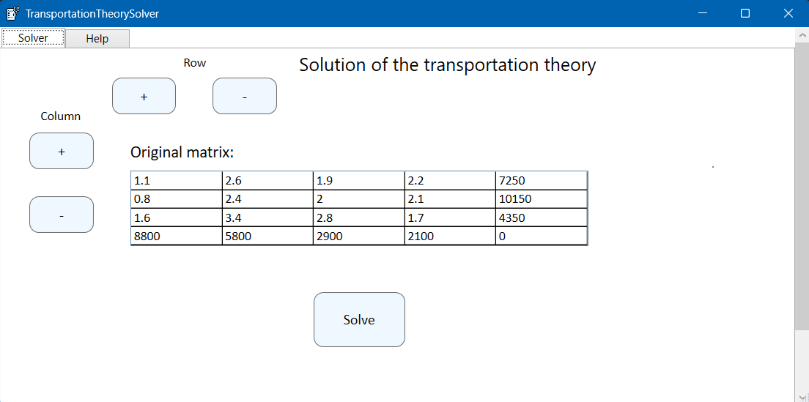

# 🚚 Transportation Problem Solver

This application solves the classic [transportation problem](https://en.wikipedia.org/wiki/Transportation_theory_(mathematics)) in linear programming using a graphical interface built with [WPF](https://en.wikipedia.org/wiki/Windows_Presentation_Foundation).

It is designed to help you find the most cost-effective distribution plan from multiple suppliers to multiple consumers based on supply, demand, and cost matrix data.

---

## ✨ Features

- 📌 **Initial solution generation** using the [North-West Corner method](https://www.studysmarter.co.uk/explanations/math/decision-maths/the-north-west-corner-method/)
- 🎯 **Optimization of the solution** via the [Potential Method (MODI Method)](https://ru.wikipedia.org/wiki/%D0%9C%D0%B5%D1%82%D0%BE%D0%B4_%D0%BF%D0%BE%D1%82%D0%B5%D0%BD%D1%86%D0%B8%D0%B0%D0%BB%D0%BE%D0%B2)
- 🖥️ **Intuitive WPF interface** for data input and visual representation of the solution
- 🧮 Supports unbalanced problems (adds fake supply or demand rows/columns automatically)

---

## 🖼 Interface Preview
> 

---

## 🛠 Technologies Used

- **Language:** C#
- **Framework:** [.NET / WPF](https://learn.microsoft.com/en-us/dotnet/desktop/wpf/)
- **UI Pattern:** MVVM (Model-View-ViewModel)

---

## 🚀 Getting Started

1. Clone the repository:

```bash
git clone https://github.com/your-username/transportation-problem.git
```

## 📖 How It Works
1. Enter supply, demand, and cost matrix into the app.
2. Click "Solve" to construct an initial possible solution using the North-West Corner Rule.
3. App automatically optimizes the plan using the Potential Method to reach an optimal distribution.
4. View results including filled cost matrix and total transportation cost.

## 📎 Example Problem
|        | D1 | D2 | D3 | Supply |
|--------|----|----|----|--------|
| S1     | 4  | 6  | 8  | 20     |
| S2     | 2  | 5  | 7  | 30     |
| S3     | 3  | 4  | 6  | 25     |
| Demand | 15 | 35 | 25 |

## 📫 Contributing
Pull requests are welcome! For major changes, please open an issue first to discuss what you would like to change.

## 👤 Author
Made with ❤️ by FoxInGloves
